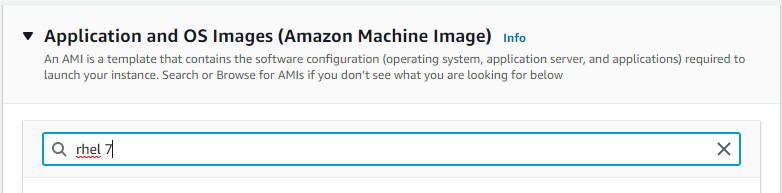
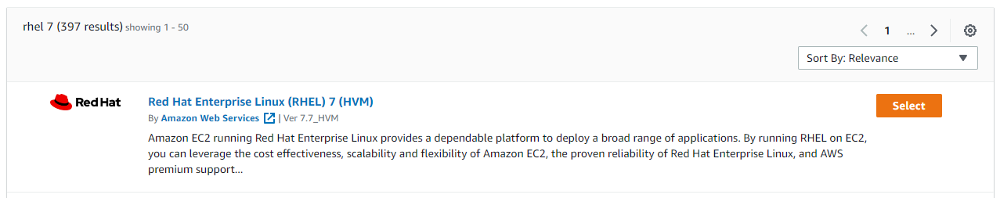
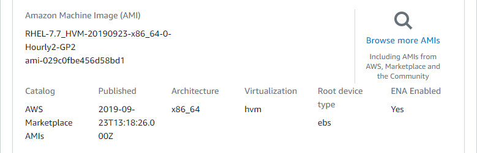
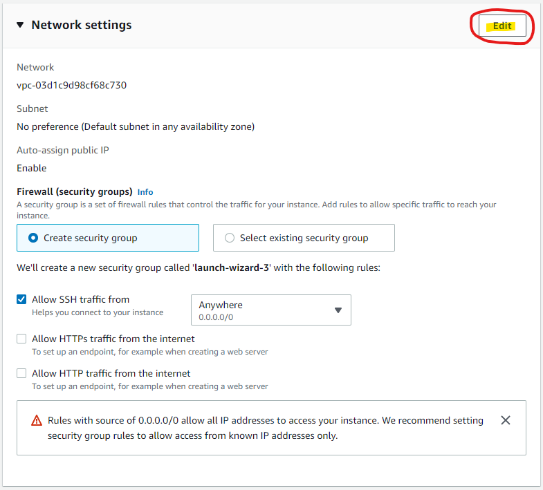
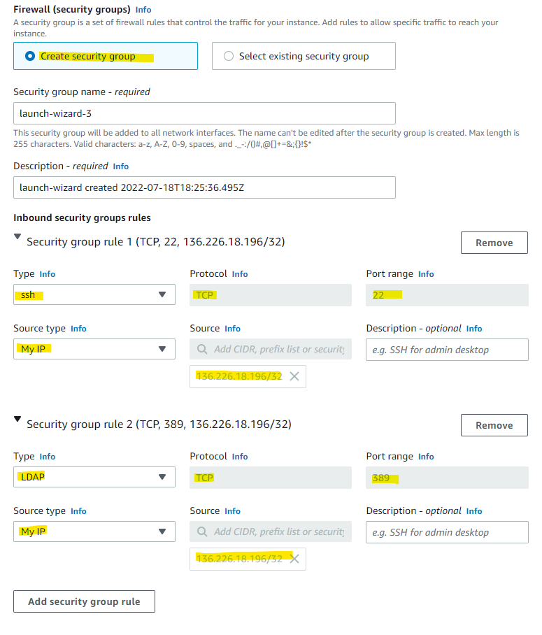
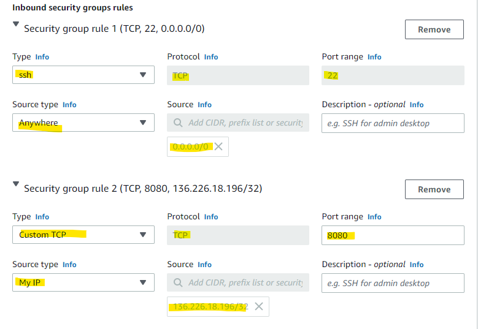

# OpenLDAP-Project
Repository of notes for the OpenLDAP Project

# Other useful links
* [Copy a file to EC2](https://medium.com/srcecde/copy-file-directory-to-from-ec2-using-scp-secure-copy-685c46636399)
* [Store git username but not password](https://stackoverflow.com/questions/54507296/how-to-have-git-store-only-my-username-and-not-my-password#:~:text=If%20you%20want%20to%20store,the%20URL%20for%20the%20remote.)

## Apache Directory Studio
* In order to get Apache to properly run, I had to [download and install OpenJDK](https://adoptopenjdk.net/)

## MobaxTerm
* There aren't any explicit instructions on what to do with MobaxTerm. I started to use it as a terminal to connect to EC2.

## Setting up EC2

* Followed [This youtube video](https://www.youtube.com/watch?v=rIi8Pd5Uvbc)
* On the project they are using RedHat Enteprise Linux when they set up environments

### Selecting RedHat OS & Security settings
* Select RedHat Enterprise








* Add inbound rules to Security group




### Security for OpenLDAP


### Security for Ansible



## Installing OpenLDAP to EC2 Instance

### On RHEL7
* Following [install & config. instructions](https://cyberithub.com/best-steps-to-install-and-configure-openldap-server-on-rhel-centos-7-8/#Step_1_Prerequisites)
* [Needed documentation](https://www.digitalocean.com/community/tutorials/how-to-change-account-passwords-on-an-openldap-server#changing-the-rootdn-password) for knowing and changing the root password and user

### Tasks to automate
* [Update base domain name](https://stackoverflow.com/questions/19537319/change-basedn-in-openldap)
* ```slapadd -b "dc=doed,dc=fsa,dc=com" -v -u -l init_ldap_struc.ldif```
* 


## Installing Ansible to EC2 Instance

### On RHEL7
* Following [install & config. instructions](https://developers.redhat.com/blog/2016/08/15/install-ansible-on-rhel#)

## Connecting Ansible Server to OpenLDAP
* [Ansible Documentation](https://docs.ansible.com/ansible/latest/getting_started/index.html)
* I ultimatley followed [this video](https://youtube.com/watch?v=EGWyN6DMI1g) because at times the ansible doc is very vauge with steps

## Using Ansible for the first time
* format of a playbook
* To create a new playbook, ```$ vim <descript>.yml```
* you can copy and paste a test yaml from [here](/ansible/playbook/Simple-install.yml)
```yml
#every playbook starts with three dashes
--- 
-name: <description>
 hosts: all #You can specify the server/cluster to run this playbook on
 become: true #Use this to run the playbook as root user
 
 tasks:
     name: <description>
     <module>...
     
     name: <description>
     <module>...
```
