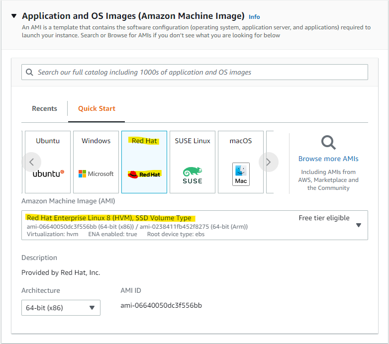

# OpenLDAP-Project
Repository of notes for the OpenLDAP Project

## Setting up EC2

* Followed [this youtube video](https://www.youtube.com/watch?v=rIi8Pd5Uvbc)
* Andrew provided that on the project they are using RedHat Enteprise Linux when they set up environments

### Difference from video
* Select RedHat Enterprise

