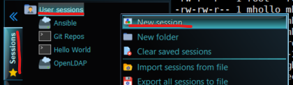
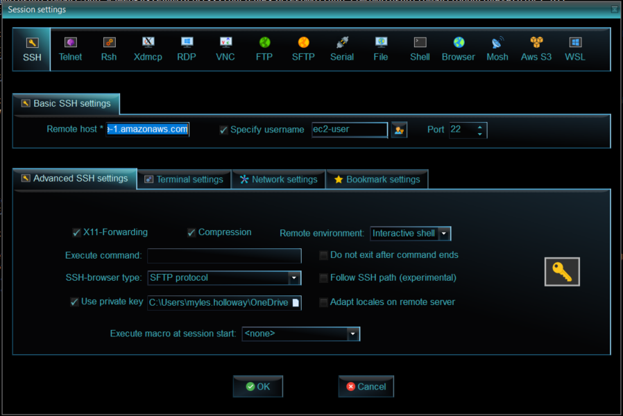

# Hello Ansible
Repository of notes and examples for Ansible

## Miscellaneous Info
* [Copy a file to EC2](https://medium.com/srcecde/copy-file-directory-to-from-ec2-using-scp-secure-copy-685c46636399)
* [Store git username but not password](https://stackoverflow.com/questions/54507296/how-to-have-git-store-only-my-username-and-not-my-password#:~:text=If%20you%20want%20to%20store,the%20URL%20for%20the%20remote.)

## Setting Up an Ansible EC2
* Followed [This youtube video](https://www.youtube.com/watch?v=rIi8Pd5Uvbc)
* we are using RedHat Enteprise Linux when we set up environments

### Selecting RedHat OS & Security Settings
* Select RedHat Enterprise

* Add inbound rules to Security group

### Security for Ansible

### Installing Ansible to EC2 Instance
* Following [install & config. instructions](https://developers.redhat.com/blog/2016/08/15/install-ansible-on-rhel#)

## MobaxTerm
* The team uses Mobaxterm and it's sessions to connect to EC2s and such.

### Creating a new session
* To create a connection to your EC2 instance in MobaxTerm, select the sessions tab on the left, right click user sessions > New Session

* Enter the following information gathered from your AWS EC2

# OpenLDAP Project

## Apache Directory Studio
* In order to get Apache to properly run, I had to [download and install OpenJDK](https://adoptopenjdk.net/)

## Security for OpenLDAP

## Installing OpenLDAP to EC2 Instance
* Following [install & config. instructions](https://cyberithub.com/best-steps-to-install-and-configure-openldap-server-on-rhel-centos-7-8/#Step_1_Prerequisites)
* [Needed documentation](https://www.digitalocean.com/community/tutorials/how-to-change-account-passwords-on-an-openldap-server#changing-the-rootdn-password) for knowing and changing the root password and user

## Connecting Ansible Server to OpenLDAP
* [Ansible Documentation](https://docs.ansible.com/ansible/latest/getting_started/index.html)
* I ultimatley followed [this video](https://youtube.com/watch?v=EGWyN6DMI1g) because at times the ansible doc is very vauge with steps
